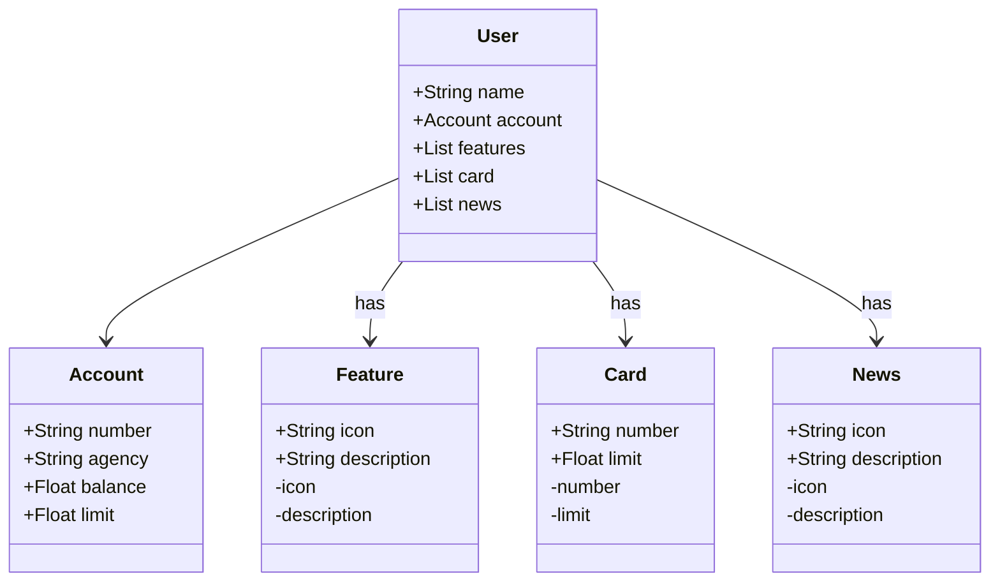

# Santander API - Dev Week
Java RESTful API do Santander Dev Week

### Diagrama de Classes

```mermaid
classDiagram
    class User {
        +String name
        +Account account
        +List<Feature> features
        +List<Card> card
        +List<News> news
    }

    class Account {
        +String number
        +String agency
        +Float balance
        +Float limit
    }

    class Feature {
        +String icon
        +String description
    }

    class Card {
        +String number
        +Float limit
    }

    class News {
        +String icon
        +String description
    }

    User --> Account
    User --> Feature : has
    User --> Card : has
    User --> News : has
    Feature : -icon
    Feature : -description
    Card : -number
    Card : -limit
    News : -icon
    News : -description


```
